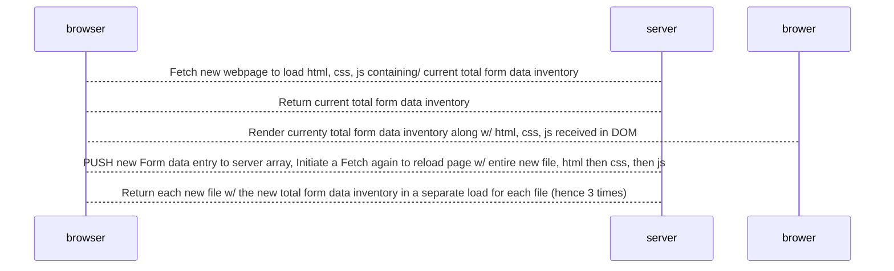
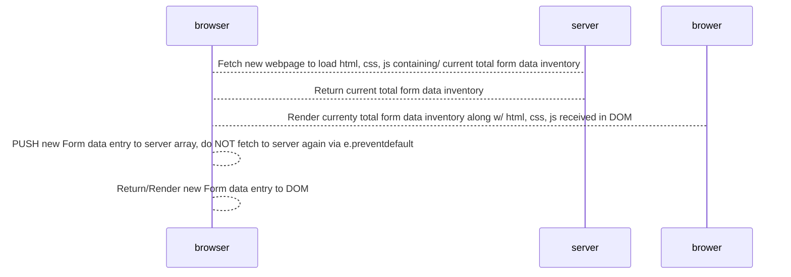

```mermaid
  sequenceDiagram;
    browser-->server: Fetch new webpage to load html, css, js containing/ current total form data inventory
    server-->browser: Return current total form data inventory
    brower-->browser: Render currenty total form data inventory along w/ html, css, js received in DOM
    browser-->server: PUSH new Form data entry to server array, Initiate a Fetch again to reload page w/ entire new file, html                         then css, then js
    server-->browser: Return each new file w/ the new total form data inventory in a separate load for each file (hence 3 times)
```

```mermaid
  sequenceDiagram;
  browser-->server: Fetch new webpage to load html, css, js containing/ current total form data inventory
  server-->browser: Return current total form data inventory
  brower-->browser: Render currenty total form data inventory along w/ html, css, js received in DOM
  browser-->browser: PUSH new Form data entry to server array, do NOT fetch to server again via e.preventdefault
  browser-->browser: Return/Render new Form data entry to DOM
    
```

/* 
https://fullstackopen.com/en/part0/fundamentals_of_web_apps

https://github.com/mermaid-js/mermaid/blob/develop/README.md
https://mermaid.js.org/syntax/flowchart.html
*/
